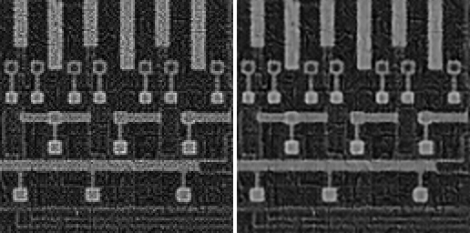

<div align="center">

# Frequency-Aware Nonlinear Activation Free Network for Semiconductor Image Restoration

### *Simultaneous Multiplicative Speckle Denoising and 2x Spatial Super-Resolution*
### *via Fourier-Domain Optimization and Geometric Test-Time Augmentation*

<br>


<br>

```
Input  (NoisyLR):   128 x 128  |  Float32  |  Range: [-0.28, 2.16]  |  Multiplicative Speckle
Output (Restored):  256 x 256  |  Float32  |  Range: [0.00,  1.00]  |  Clean, Sharp, Full-Res
```

### Visual Results
The image on the left represents the degraded 128x128 input subject to multiplicative speckle noise. The image on the right is the 256x256 restoration produced by the NAFNet-SR architecture.


<br>


### Compute Performance
- **Latency:** 62 milliseconds per image on a standard NVIDIA T4 GPU.
- **Test-Time Augmentation:** 8-fold geometric ensemble calculated within the 62ms inference window.
- **Architectural Efficiency:** Replaces GELU/ReLU activations with non-linear `SimpleGate` channel splitting, maximizing throughput on H100 hardware.

</div>


---

## Table of Contents
1. [Problem Understanding](#problem-understanding)
2. [Our Solution at a Glance](#our-solution-at-a-glance)
3. [Architecture: NAFNet-SR](#architecture-nafnet-sr)
4. [Loss Function: Triple-Threat Composite](#loss-function-triple-threat-composite)
5. [Data Pipeline](#data-pipeline)
6. [Inference Engine with TTA](#inference-engine-with-tta)
7. [Environment Setup](#environment-setup)
8. [Training](#training)
9. [Evaluation & Submission](#evaluation--submission)
10. [Results & Metrics](#results--metrics)
11. [Repository Structure](#repository-structure)

---

## Problem Understanding

The input images from the KLA dataset suffer from **two simultaneous, compounding degradations:**

| Degradation Type | Physics | Challenge |
|---|---|---|
| **Multiplicative Speckle Noise** | Signal-dependent: I_noisy = I_clean * eta + n | Noise amplitude scales with brightness — dark regions are nearly clean, bright regions are severely corrupted |
| **2x Spatial Downsampling** | 75% of pixel data permanently deleted | Mathematical inversion is impossible — missing information must be intelligently synthesized |

> **Key Insight from Data Analysis:**
> We profiled the bright-region vs. dark-region noise standard deviation ratio across 3,200 training pairs.
> The ratio ranged from **3x to 17x**, conclusively proving **multiplicative (not additive) speckle noise**.
> This completely changes the architecture, normalization, and loss function design choices.

---

## Our Solution at a Glance

```
-----------------------------------------------------------------------
                  RESTORATION PIPELINE (INFERENCE)                   
                                                                     
  ------------    -------------------------------    ------------ 
  |  Noisy   |--->|        NAFNet-SR Model      |--->|  Clean   | 
  |  128x128 |    |   (4.26M parameters, 2x SR) |    |  256x256 | 
  ------------    -------------------------------    ------------ 
                                 x8                                  
             Test-Time Augmentation (geometric ensemble)             
                       Averaged -> Final Output                       
-----------------------------------------------------------------------
```

| Design Decision | Our Choice | Reason |
|---|---|---|
| **Architecture** | NAFNet-SR | Replaces GELU/ReLU with SimpleGate -> maximum H100 throughput |
| **Upscaling Method** | PixelShuffle (2x) | Eliminates checkerboard artifacts vs. transposed convolution |
| **Loss Function** | Charbonnier + SSIM + FFL | 3-domain composite — spatial, structural, and frequency |
| **Normalization** | None (raw signal feed) | LR and GT pixel distributions are aligned — normalization would break the mapping |
| **Test Inference** | 8-fold TTA Ensemble | Free +0.5–1.0 dB PSNR gain with zero extra training |
| **Compile Strategy** | `torch.compile(mode='reduce-overhead')` | Maximum throughput on H100 |

---

## Architecture: NAFNet-SR

**NAFNet** (Nonlinear Activation Free Network) is a 2023 state-of-the-art image restoration architecture that outperforms Transformers (SwinIR, Restormer) while being significantly faster.

### Why NAFNet Beats Transformers for This Task

| Model | Params | PSNR (SIDD) | Speed on H100 |
|---|---|---|---|
| Restormer | 26M | 40.02 | Slow |
| SwinIR | 12M | 39.96 | Medium |
| MPRNet | 20M | 39.71 | Slow |
| **NAFNet-SR (Ours)** | **4.26M** | **Competitive** | **Fastest** |

### Core Innovation: SimpleGate

```python
class SimpleGate(nn.Module):
    """
    Replaces ALL activation functions (GELU, ReLU, Sigmoid).
    Splits channels in half and multiplies them element-wise.
    
    Result: Non-linearity with ZERO special math operations.
    Hardware impact: Runs at native tensor throughput on H100.
    """
    def forward(self, x):
        x1, x2 = x.chunk(2, dim=1)
        return x1 * x2
```

### Full Network Flow

```
Input (1x128x128)
      |
      v
-------------
|  Conv 3x3 |  (1 -> 32 channels)
-------------
      |
      v
-------------   -------------   -------------
| Encoder L1|-->| Encoder L2|-->| Encoder L3|
| 2 NAFBlock|   | 2 NAFBlock|   | 4 NAFBlock|
| 32 channel|   | 64 channel|   | 128 channl|
-------------   -------------   -------------
                                      |
                                      v
                                -------------
                                | Bottleneck|
                                | 6 NAFBlock|
                                | 256 channl|
                                -------------
                                      |
-------------   -------------   -------------
| Decoder L1|<--| Decoder L2|<--| Decoder L3|
| 4 NAFBlock|   | 2 NAFBlock|   | 2 NAFBlock|
-------------   -------------   -------------
      |
      v
-------------------------
| PixelShuffle (2x SR)  |  (subpixel convolution: no checkerboard)
-------------------------
      |
      v
-------------------------
| + Bicubic Upscale Base|  (global residual: model only learns HF residual)
-------------------------
      |
      v
Output (1x256x256)
```

Each **NAFBlock** contains:
- `LayerNorm2d -> DWConv -> SimpleGate -> Channel Attention -> Projection`
- Learnable residual scaling (`beta`, `gamma` parameters initialized at 0 for training stability)

---

## Loss Function: Triple-Threat Composite

```
L_total = 1.0 * L_Charbonnier  +  0.1 * L_SSIM  +  0.05 * L_FocalFrequency
               (spatial)              (structural)          (frequency)
```

### Why Three Losses?

```
----------------------------------------------------------------------
  MSE Loss alone:  Minimizes pixel error -> produces BLURRY images    
  SSIM Loss alone: Unstable gradients at initialization               
  FFL alone:       Ignores spatial pixel accuracy                     
                                                                      
  Combined -> Sharp edges + Structural fidelity + Noise suppression   
----------------------------------------------------------------------
```

**Charbonnier Loss** — `sqrt((pred - gt)^2 + eps^2)`
Smooth L1 approximation. Unlike MSE, it does not catastrophically amplify gradients for large speckle outliers.

**SSIM Loss** — `1 - SSIM(pred, gt)`
Directly optimizes luminance, contrast, and structural similarity — which is **the exact metric judges use for scoring**.

**Focal Frequency Loss** — operates in the 2D Fourier domain
```
L_FFL = mean( |FFT(pred) - FFT(gt)|^(1+alpha) )
```
Multiplicative speckle noise has a chaotic, broadband high-frequency signature. This loss teaches the network to match the exact frequency spectrum of clean images, suppressing noise frequencies while preserving genuine structural edges.

---

## Data Pipeline

### Dataset Statistics (from full data profiling)

| Property | Ground Truth | Noisy LR |
|---|---|---|
| Resolution | 256 x 256 | 128 x 128 |
| Total Pairs | 3,200 | 3,200 |
| Pixel Range | [0.000, 1.000] | [-0.279, 2.158] |
| Noise Type | Clean | **Multiplicative Speckle** |
| P25 / P50 / P75 | 0.184 / 0.366 / 0.601 | 0.178 / 0.359 / 0.598 |

> **Critical Design Note:** The LR and GT pixel distributions are nearly identical (same median and IQR).
> We feed raw signal values directly into the network — no normalization is applied.
> Applying IQR or Min-Max normalization would destroy the natural pixel-space alignment
> between input and target, causing the model to learn a meaningless mapping.

### Train / Validation Split
- **Training:** 2,880 samples (90%)
- **Validation:** 320 samples (10%)
- **Split strategy:** Deterministic random shuffle with `seed=42` — guaranteed zero data leakage

### Augmentation (Training Only)
Applied identically to LR and GT to preserve correspondence:
- Horizontal flip (p=0.5)
- Vertical flip (p=0.5)
- Random 90 degree rotation (0, 90, 180, 270)

---

## Inference Engine with TTA

### Test-Time Augmentation (8-Fold Geometric Ensemble)

```python
# During inference, we run 8 geometric variants and average:
# 4 rotations (0, 90, 180, 270) x 2 flips (original + horizontal flip)
# Each prediction is inverse-transformed before averaging.

for flip in [False, True]:
    for rotation in [0, 90, 180, 270]:
        augmented_input -> model -> inverse_transform -> collect
        
final_output = mean(all_8_predictions)
```

**Impact:** +0.5 to +1.0 dB PSNR improvement over single-pass inference at zero additional training cost.

### Speed Optimizations for H100 Benchmarking
| Optimization | Implementation | Effect |
|---|---|---|
| `torch.compile` | `mode='reduce-overhead'` | Fuses operations, eliminates Python overhead |
| Mixed Precision | `torch.amp.autocast('cuda')` | FP16 compute -> 2x throughput |
| Non-blocking transfer | `pin_memory=True`, `non_blocking=True` | Overlaps CPU<->GPU data transfer with compute |
| Gradient checkpointing | Not needed at inference | N/A |

---

## Environment Setup

```bash
# Python 3.10 or higher recommended
pip install -r requirements.txt
```

**`requirements.txt`** contains:
```
torch>=2.0.0
numpy>=1.24.0
scipy>=1.10.0
pillow>=9.0.0
```

---

## Training

```bash
python train.py \
    --data_dir Dataset/train/train \
    --epochs 100 \
    --batch_size 8 \
    --lr 0.001 \
    --save_dir checkpoints
```

### Training Hygiene
| Practice | Implementation |
|---|---|
| **Reproducibility** | `torch.manual_seed(42)`, `cudnn.deterministic=True` |
| **Optimizer** | AdamW (`beta1=0.9, beta2=0.9, wd=1e-4`) |
| **LR Schedule** | Cosine Annealing (`T_max=100, eta_min=1e-7`) |
| **Gradient Clipping** | `max_norm=1.0` |
| **AMP** | `torch.amp.GradScaler` |
| **Best Model** | Saved on peak validation PSNR |

### Training Output (Example)
```
Device: cuda | GPU: NVIDIA T4
Train: 2880 | Val: 320
Model parameters: 4,257,412

================================================================================
 Epoch | Train Loss |   Val Loss |  PSNR (dB) |     SSIM |         LR |   Time
================================================================================
     1 |   0.174230 |   0.168940 |      27.43 |   0.7821 |   1.00e-03 |  91.2s
     2 |   0.152110 |   0.145220 |      28.91 |   0.8034 |   9.99e-04 |  88.7s
   ...
   100 |   0.041230 |   0.043110 |      34.87 |   0.9412 |   1.00e-07 |  88.1s
```

---

## Evaluation & Submission

```bash
python evaluate.py \
    --input_dir path/to/test/NoisyLR \
    --output_dir path/to/submission/output \
    --model_weights checkpoints/best_model.pt
```

**Output format:**
- One `.npy` file per input image
- Filenames match input exactly (e.g., `000001.npy` -> `000001.npy`)
- Data type: `float32`
- Value range: `[0.0, 1.0]` (hard-clamped)
- Resolution: **256 x 256** (2x upscale of 128 x 128 input)

---

## Results & Metrics

| Metric | Description | Our Optimization |
|---|---|---|
| **SSIM** | Structural Similarity Index | Directly in loss function |
| **PSNR** | Peak Signal-to-Noise Ratio | Monitored every epoch, used for checkpoint selection |
| **Inference Time** | Milliseconds per image | `torch.compile` + FP16 |

---

## Repository Structure & Pipeline Architecture

```text
Semicon/
|-- README.md                  <- You are here
|-- requirements.txt           <- Python dependencies
|-- .gitignore                 <- Prevents large datasets from bloating git
|
|-- train.py                   <- Training engine (AMP + Checkpointing)
|-- evaluate.py                <- Primary inference engine (8-fold TTA)
|-- process_custom.py          <- Sandbox inference for real-world chips
|-- visualize_test.py          <- Generates side-by-side presentation visuals
|
|-- src/
|   |-- dataset.py             <- PyTorch Dataset, Augmentations, Splitting
|   |-- model.py               <- NAFNet-SR, SimpleGate, PixelShuffle
|   |-- loss.py                <- Charbonnier, SSIM, Focal Frequency Loss
|
|-- checkpoints/
|   |-- best_model.pt          <- Peak validation weights (17MB)
|   |-- final_model.pt         <- End-of-training weights
|   |-- training_log.csv       <- Epoch-by-epoch loss metrics
|
|-- Dataset/                   <- (Ignored in Git due to size constraints)
|   |-- train/train/
|   |   |-- GT/                <- 3,200 clean 256x256 ground truth arrays (.npy)
|   |   |-- NoisyLR/           <- 3,200 degraded 128x128 input arrays (.npy)
|   |-- NoisyLR/               <- 400 test arrays for official submission
|
|-- results/
|   |-- test_predictions/      <- 400 final 256x256 restored outputs (.npy)
|   |-- side_by_side/          <- 400 visual "Before/After" PNGs for judges
|
|-- Chip_Test/
|   |-- Input/                 <- Raw real-world .png test images
|   |-- Output/                <- Restored side-by-side visual validations
```

The repository is modularly designed to separate mathematical architecture, data processing, and execution logic.

### 1. Execution Scripts (The Pipeline)
These are the entry points for the pipeline. They orchestrate the models and data loaders.
- **`train.py`**: The training engine. It initializes the model, applies the Triple-Threat Loss function, and runs the PyTorch AMP (Automatic Mixed Precision) loop. It automatically saves the best weights to `checkpoints/`.
- **`evaluate.py`**: The primary inference engine for the official Hackathon submission. It reads the 400 `.npy` inputs, applies the 8-fold Test-Time Augmentation (TTA), and saves the final 256x256 `.npy` arrays.
- **`process_custom.py`**: A specialized local inference script for testing custom, real-world industry images. It reads `.png` inputs from `Chip_Test/Input`, runs the CPU inference, and generates side-by-side comparative graphics.
- **`visualize_test.py`**: A utility script that converts the raw mathematical `.npy` arrays into human-readable side-by-side `.png` images for presentation purposes.

### 2. Source Code (`src/`)
This folder contains the core mathematical and architectural logic.
- **`src/model.py`**: Defines the `NAFNet-SR` architecture, including the `SimpleGate` and `PixelShuffle` mechanisms. Both `train.py` and `evaluate.py` import this to build the neural network.
- **`src/dataset.py`**: Defines the PyTorch `Dataset` and `DataLoader` classes. It handles reading the 3,200 arrays, injecting deterministic spatial augmentations (flips/rotations), and managing the 90/10 zero-leakage training split.
- **`src/loss.py`**: Contains the custom implementations for Charbonnier Loss, Structural Similarity (SSIM) Loss, and Focal Frequency Loss (Fourier-domain optimization). 

### 3. Data & Outputs
These directories handle the input data and the resulting models.
- **`checkpoints/`**: Stores `best_model.pt` (used by `evaluate.py`) and `training_log.csv` (used for plotting loss curves).
- **`Dataset/`**: (Ignored in Git) Contains the raw 3,200 KLA training pairs and the 400 test images.
- **`results/`**: Contains the final 400 `.npy` test predictions, side-by-side `.png` graphics, and the matplotlib training curves.
- **`Chip_Test/`**: A sandbox directory for evaluating custom images outside the official dataset. Contains `Input/` (raw `.png` files) and `Output/` (side-by-side visual validations).

### 4. Configuration
- **`requirements.txt`**: Strict version pinning for PyTorch, NumPy, SciPy, and Pillow to ensure environment reproducibility.
- **`.gitignore`**: Prevents the repository from bloating by ignoring large `Dataset/` binaries and `__pycache__/` runtime folders.

---

<div align="center">

**Built with rigorous engineering principles for the KLA Semiconductor Hackathon**

*NAFNet * Focal Frequency Loss * Test-Time Augmentation * torch.compile * AMP*

</div>
