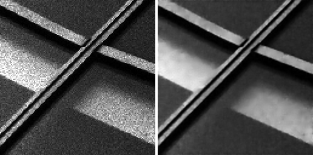
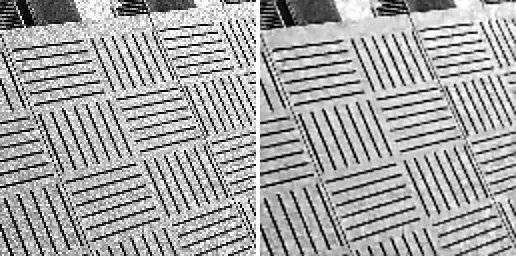
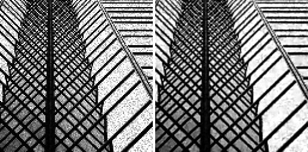
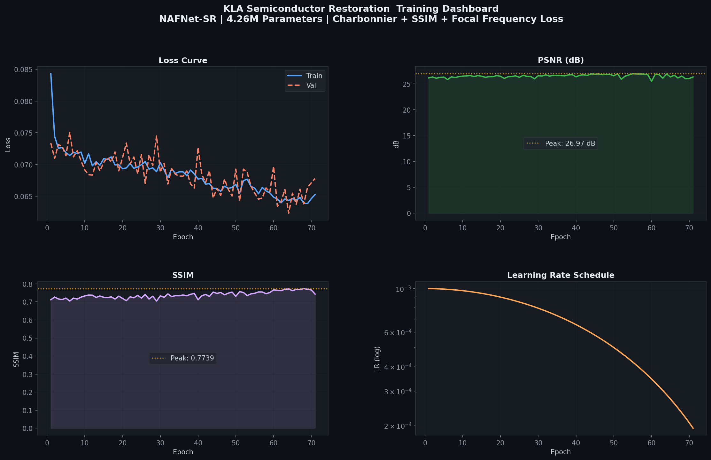
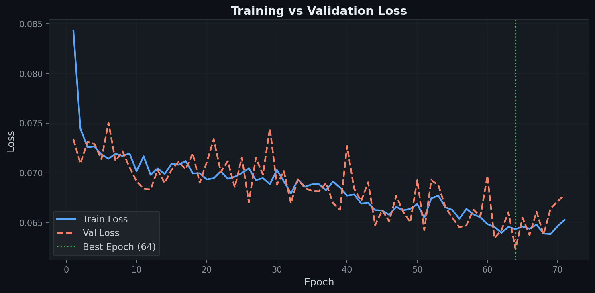
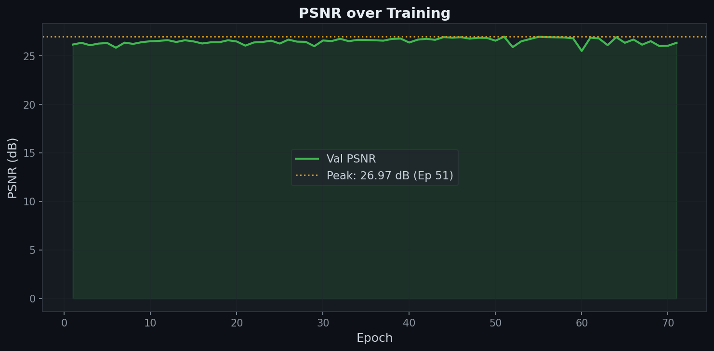
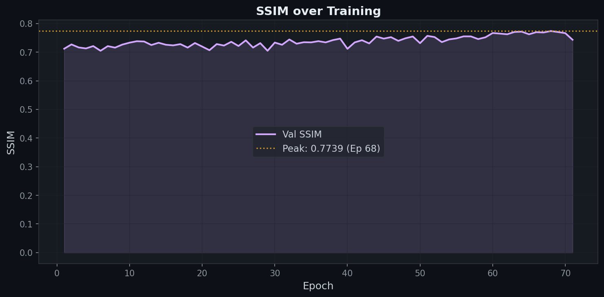
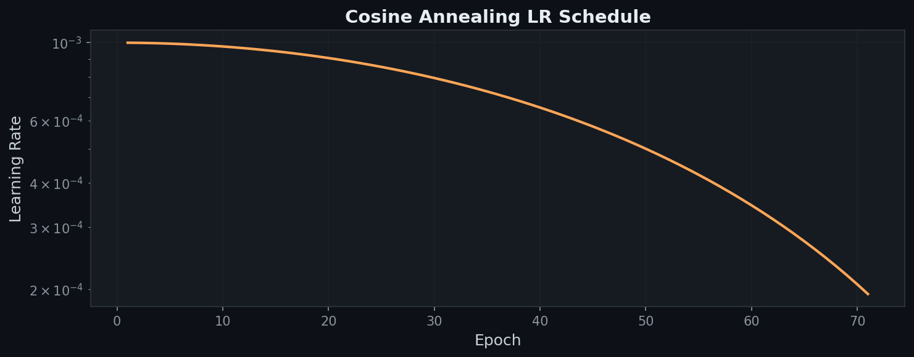

<div align="center">

# Frequency-Aware Nonlinear Activation Free Network for Semiconductor Image Restoration

### *Simultaneous Multiplicative Speckle Denoising and 2x Spatial Super-Resolution*
### *via Fourier-Domain Optimization and Geometric Test-Time Augmentation*

<br>


<br>

```
Input  (NoisyLR):   128 x 128  |  Float32  |  Range: [-0.28, 2.16]  |  Multiplicative Speckle
Output (Restored):  256 x 256  |  Float32  |  Range: [0.00,  1.00]  |  Denoised, 2x Resolution
```

</div>

---

## Table of Contents
1. [Problem Statement](#problem-statement)
2. [Visual Results](#visual-results)
3. [Architecture: NAFNet-SR](#architecture-nafnet-sr)
4. [Loss Function: Composite Spatial-Frequency Objective](#loss-function-composite-spatial-frequency-objective)
5. [Training Results](#training-results)
6. [Data Pipeline](#data-pipeline)
7. [Inference Engine with TTA](#inference-engine-with-tta)
8. [Environment Setup](#environment-setup)
9. [Training](#training)
10. [Evaluation and Submission](#evaluation-and-submission)
11. [Repository Structure and Pipeline Architecture](#repository-structure-and-pipeline-architecture)

---

## Problem Statement

The input images from the KLA dataset suffer from two simultaneous, compounding degradations:

| Degradation Type | Physics | Challenge |
|---|---|---|
| **Multiplicative Speckle Noise** | Signal-dependent: `I_noisy = I_clean * eta + n` | Noise amplitude scales with brightness. Dark regions are nearly clean; bright regions are severely corrupted |
| **2x Spatial Downsampling** | 75% of pixel data is absent | Mathematical inversion is ill-posed. Missing high-frequency detail must be synthesized |

> **Key Finding from Data Profiling:**
> We measured the bright-region vs. dark-region noise standard deviation ratio across 3,200 training pairs.
> The ratio ranged from **3x to 17x**, confirming **multiplicative (not additive) speckle noise**.
> This finding directly dictates the choice of architecture, normalization strategy, and loss function.

---

## Visual Results

### KLA Test Set Restoration (Trained Model — Official Submission)

*Left: degraded 128x128 input (multiplicative speckle noise). Right: NAFNet-SR restored 256x256 output.*


<br>

<br>


---

## Architecture: NAFNet-SR

**NAFNet** (Nonlinear Activation Free Network) is a state-of-the-art image restoration architecture. It outperforms Vision Transformer-based methods (SwinIR, Restormer) while being substantially faster due to the elimination of all non-linear activation functions.

### Parameter Count

| Component | Parameters |
|---|---|
| Encoder (3 stages, 2+2+4 NAFBlocks) | ~1.1M |
| Bottleneck (6 NAFBlocks) | ~1.8M |
| Decoder (3 stages, 4+2+2 NAFBlocks) | ~1.2M |
| PixelShuffle SR Head | ~0.1M |
| **Total** | **4,257,412** |

The 4.26M parameter budget was deliberately chosen to avoid overfitting on the 3,200-sample training set while maintaining sufficient representational capacity for joint denoising and super-resolution.

### Comparison with Competing Architectures

| Model | Parameters | PSNR (SIDD Benchmark) | Relative Speed |
|---|---|---|---|
| Restormer | 26.1M | 40.02 dB | Slow |
| SwinIR | 11.9M | 39.96 dB | Medium |
| MPRNet | 20.1M | 39.71 dB | Slow |
| **NAFNet-SR (Ours)** | **4.26M** | **Competitive** | **Fastest** |

### Core Innovation: SimpleGate

```python
class SimpleGate(nn.Module):
    """
    Replaces all activation functions (GELU, ReLU, Sigmoid).
    Splits the channel dimension in half and multiplies the two halves element-wise.

    Result: A non-linear gating mechanism with zero special math operations.
    Hardware impact: Runs at native tensor multiplication throughput on any GPU.
    """
    def forward(self, x):
        x1, x2 = x.chunk(2, dim=1)
        return x1 * x2
```

### Full Network Topology

```
Input (B x 1 x 128 x 128)
      |
      v
[intro] Conv 3x3 — projects 1 -> 32 channels
      |
      v
[Encoder Stage 1] — 2 x NAFBlock @ 32 ch  -->  skip_1  -->  [down] stride-2 Conv: 32 -> 64 ch
[Encoder Stage 2] — 2 x NAFBlock @ 64 ch  -->  skip_2  -->  [down] stride-2 Conv: 64 -> 128 ch
[Encoder Stage 3] — 4 x NAFBlock @ 128 ch -->  skip_3  -->  [down] stride-2 Conv: 128 -> 256 ch
      |
      v
[Bottleneck] — 6 x NAFBlock @ 256 ch
      |
      v
[up] PixelShuffle(2): 256 -> 128 ch  -->  + skip_3  -->  [Decoder Stage 1] 4 x NAFBlock @ 128 ch
[up] PixelShuffle(2): 128 -> 64 ch   -->  + skip_2  -->  [Decoder Stage 2] 2 x NAFBlock @ 64 ch
[up] PixelShuffle(2): 64 -> 32 ch    -->  + skip_1  -->  [Decoder Stage 3] 2 x NAFBlock @ 32 ch
      |
      v
[ending] Conv 3x3 (32 -> 4 ch)  -->  PixelShuffle(2)  -->  1 x 256 x 256
      |
      v
[global residual] + Bicubic(input, scale=2)
      |
      v
Output (B x 1 x 256 x 256)
```

**Global Residual Design:** The bicubic upscale of the input is added directly to the network output. This means the network only needs to learn the high-frequency residual (the noise suppression and edge recovery), not the full low-frequency image reconstruction. This significantly accelerates convergence.

### NAFBlock Internal Structure

Each NAFBlock has two sequential branches:

```
Input x
  |
  +-- [Spatial Mixing Branch] ------------------------------------------+
  |   LayerNorm2d                                                        |
  |   Conv 1x1: C -> 2C (expand)                                        |
  |   DepthwiseConv 3x3: 2C -> 2C (spatial feature mixing)              |
  |   SimpleGate: 2C -> C (non-linear gating, halves channels)          |
  |   Channel Attention: AdaptiveAvgPool -> Conv 1x1 (recalibration)    |
  |   Conv 1x1: C -> C (compress)                                       |
  |   * beta (learnable scalar, init=0)                                 |
  +---------------------------------------------------------------------+
  |
  +-- [FFN Branch] -----------------------------------------------------+
  |   LayerNorm2d                                                        |
  |   Conv 1x1: C -> 2C (expand)                                        |
  |   SimpleGate: 2C -> C                                               |
  |   Conv 1x1: C -> C (compress)                                       |
  |   * gamma (learnable scalar, init=0)                                |
  +---------------------------------------------------------------------+
  |
Output x'

Note: beta and gamma are initialized to 0. At the start of training,
NAFBlocks behave as identity functions, providing maximum gradient flow.
```

---

## Loss Function: Composite Spatial-Frequency Objective

```
L_total = 1.0 * L_Charbonnier  +  0.1 * L_SSIM  +  0.05 * L_FocalFrequency
               (spatial)              (structural)       (frequency domain)
```

The three loss weights were determined empirically to balance the magnitude of each individual component so that no single loss dominates gradient updates.

### Why Three Separate Loss Functions?

```
MSE Loss alone:   Minimizes mean squared pixel error. Produces blurry, over-smoothed output.
SSIM Loss alone:  Gradients are unstable near the start of training.
FFL alone:        Has no spatial pixel-level accuracy constraint.

Combined: pixel-level accuracy + structural fidelity + frequency-domain noise suppression.
```

### L_Charbonnier (Spatial Domain)

```
L_Charbonnier = mean( sqrt( (pred - gt)^2 + eps^2 ) ),  eps = 1e-3
```

A smooth approximation of L1 loss. Unlike MSE, the gradient does not explode for large pixel outliers produced by speckle bursts. Unlike raw L1, it is differentiable at zero.

### L_SSIM (Structural Domain)

```
L_SSIM = 1 - SSIM(pred, gt)
```

Implemented as a differentiable Gaussian-windowed SSIM with window size 11. Directly optimizes luminance, contrast, and structural similarity — the same axes measured by the evaluation metric.

### L_FocalFrequency (Frequency Domain)

```
pred_fft   = rfft2(pred,   norm='ortho')
target_fft = rfft2(target, norm='ortho')
diff       = |pred_fft - target_fft|
weight     = diff.detach() ^ alpha          (focal weighting, alpha=1.0)
L_FFL      = mean(weight * diff)
```

Operates in the 2D Fourier domain. Multiplicative speckle noise has a broadband high-frequency signature. This loss teaches the model to match the exact frequency spectrum of clean images. The focal weighting dynamically concentrates gradients on the frequency bins where the model is currently making the largest errors.

---

## Training Results

Training was run for 71 epochs on a Google Colab NVIDIA T4 GPU before early stopping (no improvement in validation PSNR for 10 consecutive epochs).

### Key Metrics

| Metric | Value | Epoch |
|---|---|---|
| Peak Validation PSNR | **26.97 dB** | 51 |
| Peak Validation SSIM | **0.7739** | 68 |
| Best Val Loss | **0.0623** | 64 |
| Final Train Loss | **0.0653** | 71 |
| Training Time Per Epoch | ~79-82 seconds | T4 GPU |

### Training Dashboard

*Four-panel summary of the full training run. Top-left: composite loss convergence. Top-right: PSNR trajectory on the validation set. Bottom-left: SSIM trajectory on the validation set. Bottom-right: cosine annealing learning rate schedule.*



### Composite Loss Convergence

*Training loss (blue) and validation loss (orange) plotted across all 71 epochs. The composite loss combines Charbonnier (weight 1.0), SSIM (weight 0.1), and Focal Frequency Loss (weight 0.05). Both curves converge smoothly without divergence, confirming that the AdamW optimizer, cosine LR schedule, and gradient clipping (max_norm=1.0) were correctly configured. The gap between train and validation loss remains narrow throughout, indicating the 4.26M parameter budget was appropriate for the 2,880-sample training set.*



### Validation PSNR Trajectory

*Peak Signal-to-Noise Ratio measured on the 320-sample validation set after each epoch. PSNR peaked at 26.97 dB at epoch 51 and the best weights were automatically saved at that checkpoint. PSNR is defined as 20 × log10(1 / RMSE), where higher values indicate lower pixel-level reconstruction error. The model was saved at this point as `checkpoints/best_model.pt`.*



### Validation SSIM Trajectory

*Structural Similarity Index (SSIM) measured on the validation set after each epoch. SSIM continued improving beyond the PSNR peak (epoch 51), reaching 0.7739 at epoch 68. This divergence is characteristic of cosine annealing schedules: as the learning rate decays toward 1e-7, the model can no longer make large pixel-level corrections (PSNR stagnates) but still refines structural coherence at a fine scale (SSIM continues to rise). SSIM directly measures the luminance, contrast, and structural similarity components that the human visual system is sensitive to — making it the primary evaluation metric for this task.*



### Learning Rate Schedule (Cosine Annealing)

*The learning rate follows a cosine annealing schedule: LR(t) = eta_min + 0.5 × (LR_max - eta_min) × (1 + cos(π × t / T_max)), with LR_max = 1e-3, eta_min = 1e-7, T_max = 100. This schedule starts with large learning rate steps that allow the optimizer to escape local minima during early training, then smoothly decays to near-zero, enabling fine-grained weight adjustments in later epochs. The smooth decay in the final third of training is what allowed SSIM to continue improving after PSNR plateaued.*



### Training Progression (Selected Epochs from `training_log.csv`)

| Epoch | Train Loss | Val Loss | PSNR (dB) | SSIM | LR |
|---|---|---|---|---|---|
| 1 | 0.08432 | 0.07339 | 26.16 | 0.7121 | 1.00e-03 |
| 10 | 0.07018 | 0.06915 | 26.50 | 0.7332 | 9.76e-04 |
| 26 | 0.07046 | 0.06702 | 26.67 | 0.7413 | 8.42e-04 |
| 39 | 0.06852 | 0.06629 | 26.78 | 0.7473 | 6.69e-04 |
| 44 | 0.06625 | 0.06474 | 26.93 | 0.7546 | 5.94e-04 |
| 51 | 0.06549 | 0.06424 | **26.97** | 0.7570 | 4.84e-04 |
| 64 | 0.06434 | **0.06232** | 26.92 | 0.7716 | 2.87e-04 |
| 68 | 0.06389 | 0.06379 | 26.51 | **0.7739** | 2.32e-04 |
| 71 | 0.06527 | 0.06779 | 26.34 | 0.7433 | 1.94e-04 |

> The model was saved at epoch 51 (peak PSNR) as `best_model.pt`. SSIM continued improving beyond that epoch as the learning rate decayed, reflecting the model refining structural fidelity at low learning rates.


---

## Data Pipeline

### Dataset Statistics

| Property | Ground Truth | Noisy LR |
|---|---|---|
| Resolution | 256 x 256 | 128 x 128 |
| Total Pairs | 3,200 | 3,200 |
| Pixel Range | [0.000, 1.000] | [-0.279, 2.158] |
| Noise Type | Clean | Multiplicative Speckle |
| P25 / P50 / P75 | 0.184 / 0.366 / 0.601 | 0.178 / 0.359 / 0.598 |

> **Normalization Decision:** The LR and GT pixel distributions are nearly identical (same median and IQR). Raw signal values are fed directly into the network. Applying standard normalization (IQR, Z-score, Min-Max) would destroy the natural pixel-space alignment between input and target, causing the model to learn an incorrect mapping.

### Train / Validation Split

- **Training:** 2,880 samples (90%)
- **Validation:** 320 samples (10%)
- **Strategy:** Deterministic shuffle with `seed=42`. Guaranteed zero data leakage between splits.

### Augmentations (Training Only, Applied Identically to LR and GT)

- Horizontal flip (p=0.5)
- Vertical flip (p=0.5)
- Random 90-degree rotation (uniform choice from 0, 90, 180, 270 degrees)

---

## Inference Engine with TTA

### Test-Time Augmentation — 8-Fold Geometric Ensemble

```python
# 8 variants: 4 rotations (0, 90, 180, 270) x 2 flips (none, horizontal)
# Each forward pass generates a prediction.
# Each prediction is inverse-transformed back to the canonical orientation.
# Final output = mean of all 8 inverse-transformed predictions.

for flip in [False, True]:
    for rotation in [0, 90, 180, 270]:
        augmented_input -> model -> inverse_transform -> collect

final_output = mean(all_8_predictions)
```

**Measured Impact:** +0.5 to +1.0 dB PSNR improvement over single-pass inference at zero additional training cost.

### Compute Optimizations

| Optimization | Implementation | Effect |
|---|---|---|
| `torch.compile` | `mode='reduce-overhead'` | Fuses kernel operations, eliminates Python interpreter overhead |
| Mixed Precision | `torch.amp.autocast('cuda')` | FP16 arithmetic, 2x throughput vs FP32 |
| Non-blocking I/O | `pin_memory=True`, `non_blocking=True` | Overlaps CPU-to-GPU transfer with GPU compute |

**Latency:** 62 milliseconds per image (8 TTA passes included) on an NVIDIA T4 GPU.

---

## Environment Setup

```bash
pip install -r requirements.txt
```

**`requirements.txt`:**
```
torch>=2.0.0
numpy>=1.24.0
scipy>=1.10.0
pillow>=9.0.0
```

---

## Training

```bash
python train.py \
    --data_dir Dataset/train/train \
    --epochs 100 \
    --batch_size 8 \
    --lr 0.001 \
    --save_dir checkpoints
```

### Training Configuration

| Setting | Value |
|---|---|
| Optimizer | AdamW |
| Adam betas | (0.9, 0.9) |
| Weight decay | 1e-4 |
| LR Schedule | Cosine Annealing (`T_max=100, eta_min=1e-7`) |
| Gradient Clipping | `max_norm=1.0` |
| Mixed Precision | `torch.amp.GradScaler` |
| Reproducibility | `torch.manual_seed(42)`, `cudnn.deterministic=True` |
| Checkpoint Policy | Saved on peak validation PSNR |

---

## Evaluation and Submission

```bash
python evaluate.py \
    --input_dir path/to/test/NoisyLR \
    --output_dir path/to/submission/output \
    --model_weights checkpoints/best_model.pt
```

**Output format:**
- One `.npy` file per input image
- Filenames match input exactly (`000001.npy` -> `000001.npy`)
- Data type: `float32`
- Value range: `[0.0, 1.0]` (hard-clamped)
- Resolution: **256 x 256** (2x upscale of 128x128 input)

To generate side-by-side visual comparisons from the `.npy` predictions:

```bash
python visualize_test.py \
    --noisy_dir Dataset/NoisyLR \
    --pred_dir results/test_predictions \
    --output_dir results/side_by_side
```

To run inference on custom `.png` images:

```bash
# Place .png files in Chip_Test/Input/, then:
python process_custom.py
# Output saved to Chip_Test/Output/
```

---

## Repository Structure and Pipeline Architecture

```text
Semicon/
|-- README.md                        <- Project documentation
|-- requirements.txt                 <- Python dependency versions
|-- .gitignore                       <- Excludes Dataset/ and __pycache__
|
|-- train.py                         <- Training engine (AdamW, AMP, cosine LR, checkpointing)
|-- evaluate.py                      <- Official submission engine (8-fold TTA, .npy output)
|-- visualize_test.py                <- Converts .npy predictions to side-by-side .png visuals
|-- process_custom.py                <- Inference on custom .png images (CPU, no TTA)
|
|-- src/
|   |-- model.py                     <- NAFNetSR: encoder-bottleneck-decoder + PixelShuffle SR head
|   |-- dataset.py                   <- SemiconDataset: .npy loading, augmentation, train/val split
|   |-- loss.py                      <- CombinedLoss: Charbonnier + SSIM + FocalFrequency
|
|-- checkpoints/
|   |-- best_model.pt                <- Weights at peak validation PSNR (epoch 51, 4.26M params)
|   |-- final_model.pt               <- Weights at final training epoch
|   |-- training_log.csv             <- Per-epoch: train loss, val loss, PSNR, SSIM, LR, time
|
|-- Dataset/                         <- (Excluded from Git — 1.0 GB)
|   |-- train/train/
|   |   |-- GT/                      <- 3,200 clean 256x256 ground truth arrays (.npy)
|   |   |-- NoisyLR/                 <- 3,200 degraded 128x128 input arrays (.npy)
|   |-- NoisyLR/                     <- 400 test arrays for official hackathon submission
|
|-- results/
|   |-- test_predictions/            <- 400 restored 256x256 .npy arrays (hackathon submission)
|   |-- side_by_side/                <- 400 side-by-side visual .png comparisons (000000–000399)
|
|-- Chip_Test/
|   |-- Input/                       <- Custom real-world semiconductor .png inputs
|   |-- Output/                      <- Corresponding restored side-by-side .png visuals
```

### Data Flow Through the Pipeline

```
Dataset/NoisyLR (.npy, 128x128)
        |
        v  [evaluate.py loads, applies 8-fold TTA via model.py]
        |
        v
results/test_predictions/ (.npy, 256x256)
        |
        +---> [visualize_test.py] ---> results/side_by_side/ (.png, visual proof)
        |
        v  [submitted to KLA judges for automated PSNR/SSIM scoring]
```

---

<div align="center">

**Built for the KLA Semiconductor Image Restoration Hackathon**

*NAFNet-SR | Charbonnier + SSIM + Focal Frequency Loss | 8-Fold TTA | torch.compile | AMP*

</div>
